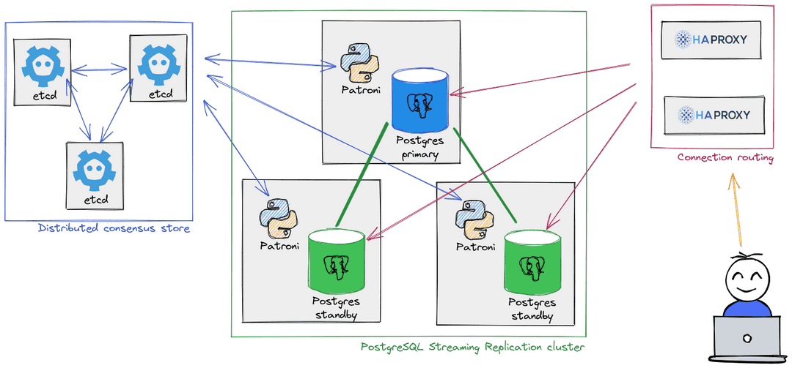

# Patroni demo

This demo is created based on PostgreSQL 15 runnning on Docker. For other Postgres version or platforms, please modify `patroni/config.yml` accordingly.

Postgres nodes p1 (primary), p2 and p3 (replicas). Etcd nodes (e1, 2, 3). HAProxies (h1, 2).

## Demo prep
- `vagrant up` provisions the nodes. Vagrantfile needs https://github.com/oscar-stack/vagrant-hosts
- Disable SELinux using `sudo grubby --update-kernel ALL --args selinux=0` and reboot.
- `tpaexec configure patroni --architecture M1 --postgresql 15 --enable-patroni --enable-haproxy --platform bare` creates the basic config.yml. Change at will.
- `tpaexec provision patroni` will create one primary, two replicas, three `etcd` nodes and two HAProxy nodes.
- `tpaexec deploy patroni` will install the required software.

## Demo flow
- SSH into the console using `vagrant ssh console`
